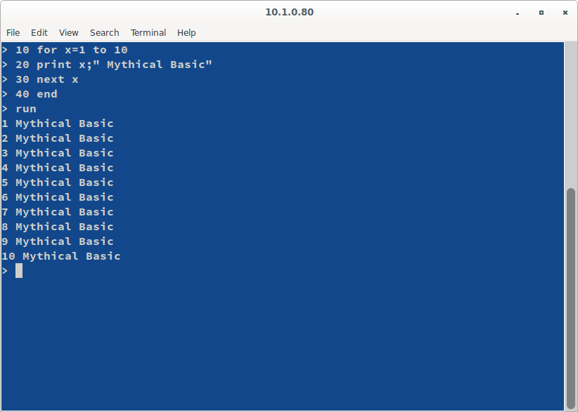
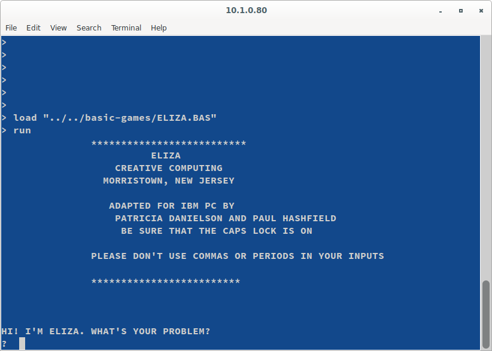

# Mythical Basic

Mythical BASIC is a classic (line-number) style BASIC interpreter written in JavaScript.  

It was written specifically to support text mode with the opportunity to override the input and output routines.  This allows it to be used with connections such as telnet, ssh, serial, ws, wss and others.  The original use case was to support a BBS that operated over many of these protocols.

It will load an run many older BASIC programs, usually with minimal modification.

Basic.js - contains the main interpreter
basicSimpleTest.js and simpleTerm.js - a simple example for vt100/BBS ansi terminals
basicTermTest.js and basicTerm.js - a readline based example.

To run the example just type:

`nodejs basicSimpleTest.js`

